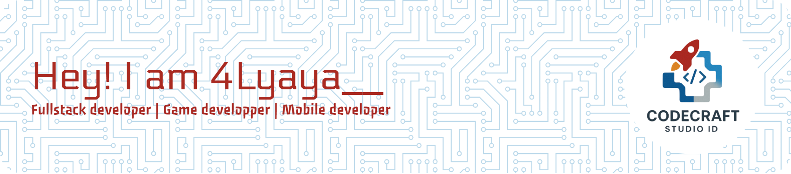

  
  
  <h1>👋 Hi, I'm 4Lyaya__</h1>
  <h3>Fullstack Developer | Mobile Developer | Game Developer</h3>
  
  
<i>🌍 Banyuwangi, Indonesia | 💼 3+ Years Experience</i>

  
  
Passionate about creating beautiful and functional digital experiences. Always learning and exploring new technologies!

  
  

    
    
  

  
  

## 🚀 About Me

I'm a versatile developer from Banyuwangi, Indonesia with over 3 years of experience creating digital solutions across web, mobile, and gaming platforms. My journey in tech has been driven by a passion for solving complex problems and delivering exceptional user experiences.

## 🛠️ Technical Expertise

### 🌐 Frontend Development

  

### 🖥️ Backend Development

  

### 🎮 Game Development

  

### 🎨 Design & Creative Tools

  

### 🛠️ Development Tools

  

---

## 📌 Current Projects

  <table>
    <tr>
      <td width="80px" align="center"></td>
      <td><strong>Portfolio Website</strong> Building a responsive showcase of my work with React and Tailwind CSS</td>
    </tr>
    <tr>
      <td width="80px" align="center"></td>
      <td><strong>Educational Mobile App</strong> Developing a learning platform for local students in Banyuwangi</td>
    </tr>
    <tr>
      <td width="80px" align="center"></td>
      <td><strong>Indie Game Project</strong> Creating a cultural exploration game featuring Indonesian heritage</td>
    </tr>
  </table>

## 🌱 Learning Journey

  <table>
    <tr>
      <td width="80px" align="center"></td>
      <td><strong>Advanced React Patterns</strong> Mastering state management and component architecture</td>
    </tr>
    <tr>
      <td width="80px" align="center"></td>
      <td><strong>UI/UX Design Principles</strong> Deepening understanding of user-centered design</td>
    </tr>
    <tr>
      <td width="80px" align="center"></td>
      <td><strong>Cloud Architecture</strong> Expanding knowledge in scalable backend solutions</td>
    </tr>
  </table>

---

## 📊 GitHub Analytics

  
  

---

## 🏆 GitHub Achievements

  

---

## 🤝 Professional Connections

  

    
    
    
    
    
    
  

---

## 💡 Personal Insights

  <table>
    <tr>
      <td width="50" align="center">🎨</td>
      <td>I begin all projects with hand-drawn sketches to visualize concepts</td>
    </tr>
    <tr>
      <td width="50" align="center">☕</td>
      <td>My coding sessions are fueled by Indonesian coffee</td>
    </tr>
    <tr>
      <td width="50" align="center">🎮</td>
      <td>Specialized in gaming UI/UX with cultural influences</td>
    </tr>
    <tr>
      <td width="50" align="center">📚</td>
      <td>Currently studying "Don't Make Me Think" by Steve Krug</td>
    </tr>
    <tr>
      <td width="50" align="center">🌋</td>
      <td>Inspired by the natural beauty of Banyuwangi's landscapes</td>
    </tr>
  </table>

---

  
  
  <h3>Let's collaborate and create something amazing! ✨</h3>
  
  

