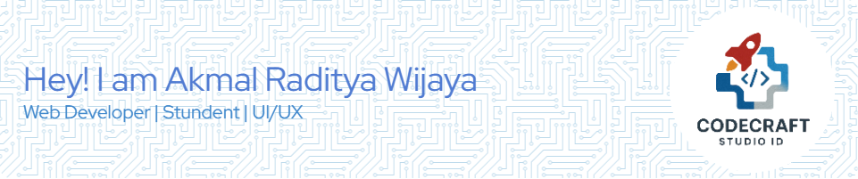

# 👋 Hi there, I'm Akmal Raditya Wijaya

🎓 **Student** | 💻 **Web Developer** | 🎨 **UI/UX Enthusiast**

Passionate about creating beautiful and functional digital experiences. Always learning and exploring new technologies!

---

## 🛠️ Tech Stack

### 💡 Programming Languages

### 🌐 Frontend Development

### 🎨 Design Tools

---

## 📌 Currently Working On
- 🔨 Building my personal portfolio website
- 📚 School projects with web development focus
- 🎨 UI/UX design experiments and case studies

## 🌱 Currently Learning
- ⚛️ Advanced React patterns
- 🖌️ UI/UX design principles
- 🗄️ Backend development with Node.js

---

## 📊 GitHub Stats

---

## 📫 Let's Connect!

---

## ⚡ Fun Facts
- 🎨 I always start projects with hand-drawn sketches
- ☕ Can't code without my favorite drink
- 🎮 Love gaming UI/UX designs
- 📚 Currently reading "Don't Make Me Think" by Steve Krug

**Let's collaborate and create something amazing!** ✨